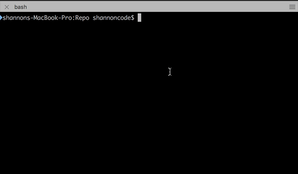
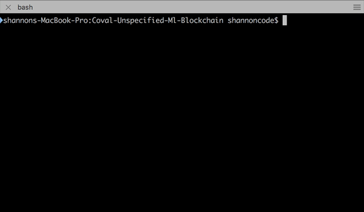

## Circuits of Value (http://cov.al) + Unspecified (http://unspecified.life)
## Blockchain and Machine Learning Collaboration

---

### Unspecified LLC: 
Applying Machine learning and Ai towards the optimization of software delivery. 

### Circuits of Value:
Framework for a new internet that’s distributed, decentralized and trustless. Turning traditional crypto currency models inside out and bridging the decide between utility and revolutionary. 

---

### Machine Learning technologies

- Python
- Gym
- Universe
- World of Bits

### Blockchain technologies

- NodeJS
- Ethereum
- Test RPC
- Coval-Solidity

---

### Executive Summary

Using Test RPC We create a light weight ethereum emulator to deploy smart contracts into.

We next deploy the ClickButton Contract using the Coval-Solidity Deployment CLI Tool

We then start the REST server from the CLI allowing interaction with the deployed contracts.

Next (having previously set up a working gym environment we run click.py)

Click.py loads the `wob.mini.ClickButton-v0` environment to begin training a model to be able to click the button requested.

Each iteration of a task records the PointerEvent's within ethereum storage for later retrieval and and historical purposes.

Click.py communicates with the contract via REST over http here: http://127.0.0.1:4333/v1/Example/ClickButton/SaveEvent/exec?args=roundId,eventId,x,y,mask

---

### How to run locally
- Install Ethereum testrpc in one terminal
  `npm install -g ethereumjs-testrpc`
- Run testrpc (terminal 1) `testrpc`

- Install Coval Solidity `npm install`
- Deploy scenario "example" (terminal 2) `npm start`

- Launch REST server from tools menu after deploying contract
  - Alternatively run from terminal `npm run web`

- Install gym and universe
`pip install gym universe`

- Launch click.py (terminal 3)
`python click.py`

### How to run within Docker

