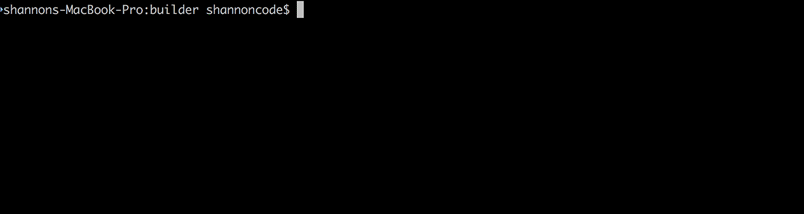
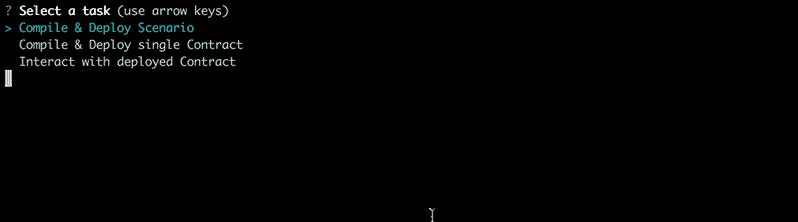
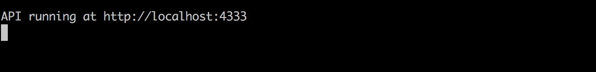

# Contract compiler, deployer and interactive interfaces.
Currently only supporting [Ether.camp](http://ether.camp) generated [Scenario files](#scenario-format).

Once a scenario file is deployed, you can interact with deployed contracts using:
- [cli and arguments](#cli-with-values), references to other [deployed contracts ({{Token.address}})](#cli-with-references)
- Interactive, [Menu driven cli](#cli-with-menu)
- Self describing (hypermedia) [REST API](#web-interface)

Very much a work in progress (Alpha) 

# Compile / Deploy Usage
Inside your ethereum project
- `git clone https://github.com/genecyber/EtherCamp-ScenarioDeployer.git builder` 
- `cd builder`
- `npm start`



# Execute Contract
There are a few ways you can interact with deployed contracts
## CLI With References
```
npm run execute -- Registry setStorage {{Storage.address}}
```


## CLI With Values
```
npm run execute -- Registry setStorage 0xfaba04dfe2b433e51d10778828a485eb53b72435
```


## CLI with Menu
```bash
npm run execute
```


## Web Interface
```
npm run web
```


### Endpoints
Web interface is self describing and dynamic. All exposed contracts and methods are available to be executed via this interface.

#### /contracts
Returns a list of deployed contracts
`/contracts`
```json
{
    "contracts": [
        "Storage",
        "Token",
        "Coval",
        "Registry",
        "StringValidate"
    ],
    "action": {
        "describe": "contracts"
    }
}
```

#### /{ContractName} 
Returns a list of available methods for specified contract
`/Token`
```json
{
    "methods": [
        {
            "name": "name",
            "params": {
                "inputs": [],
                "outputs": [
                    {
                        "name": "",
                        "type": "bytes32"
                    }
                ]
            }
        },
        {
            "name": "approve",
            "params": {
                "inputs": [
                    {
                        "name": "_spender",
                        "type": "address"
                    },
                    {
                        "name": "_value",
                        "type": "uint256"
                    }
                ],
                "outputs": [
                    {
                        "name": "success",
                        "type": "bool"
                    }
                ]
            }
        },
        {
            "name": "totalSupply",
            "params": {
                "inputs": [],
                "outputs": [
                    {
                        "name": "",
                        "type": "uint256"
                    }
                ]
            }
        },
        {
            "name": "transferFrom",
            "params": {
                "inputs": [
                    {
                        "name": "_from",
                        "type": "address"
                    },
                    {
                        "name": "_to",
                        "type": "address"
                    },
                    {
                        "name": "_value",
                        "type": "uint256"
                    }
                ],
                "outputs": [
                    {
                        "name": "success",
                        "type": "bool"
                    }
                ]
            }
        },
        {
            "name": "balances",
            "params": {
                "inputs": [
                    {
                        "name": "",
                        "type": "address"
                    }
                ],
                "outputs": [
                    {
                        "name": "",
                        "type": "uint256"
                    }
                ]
            }
        },
        {
            "name": "decimals",
            "params": {
                "inputs": [],
                "outputs": [
                    {
                        "name": "",
                        "type": "uint256"
                    }
                ]
            }
        },
        {
            "name": "mint",
            "params": {
                "inputs": [
                    {
                        "name": "_owner",
                        "type": "address"
                    },
                    {
                        "name": "_amount",
                        "type": "uint256"
                    }
                ],
                "outputs": []
            }
        },
        {
            "name": "setSymbol",
            "params": {
                "inputs": [
                    {
                        "name": "_s",
                        "type": "bytes32"
                    }
                ],
                "outputs": []
            }
        },
        {
            "name": "ownerTransferFrom",
            "params": {
                "inputs": [
                    {
                        "name": "_from",
                        "type": "address"
                    },
                    {
                        "name": "_to",
                        "type": "address"
                    },
                    {
                        "name": "_value",
                        "type": "uint256"
                    }
                ],
                "outputs": [
                    {
                        "name": "success",
                        "type": "bool"
                    }
                ]
            }
        },
        {
            "name": "version",
            "params": {
                "inputs": [],
                "outputs": [
                    {
                        "name": "",
                        "type": "string"
                    }
                ]
            }
        },
        {
            "name": "setName",
            "params": {
                "inputs": [
                    {
                        "name": "_n",
                        "type": "bytes32"
                    }
                ],
                "outputs": []
            }
        },
        {
            "name": "balanceOf",
            "params": {
                "inputs": [
                    {
                        "name": "_owner",
                        "type": "address"
                    }
                ],
                "outputs": [
                    {
                        "name": "balance",
                        "type": "uint256"
                    }
                ]
            }
        },
        {
            "name": "setDecimals",
            "params": {
                "inputs": [
                    {
                        "name": "_d",
                        "type": "uint256"
                    }
                ],
                "outputs": []
            }
        },
        {
            "name": "owner",
            "params": {
                "inputs": [],
                "outputs": [
                    {
                        "name": "",
                        "type": "address"
                    }
                ]
            }
        },
        {
            "name": "tranferFrom",
            "params": {
                "inputs": [
                    {
                        "name": "_from",
                        "type": "address"
                    },
                    {
                        "name": "_to",
                        "type": "address"
                    },
                    {
                        "name": "_value",
                        "type": "uint256"
                    }
                ],
                "outputs": [
                    {
                        "name": "success",
                        "type": "bool"
                    }
                ]
            }
        },
        {
            "name": "symbol",
            "params": {
                "inputs": [],
                "outputs": [
                    {
                        "name": "",
                        "type": "bytes32"
                    }
                ]
            }
        },
        {
            "name": "ownerTransfer",
            "params": {
                "inputs": [
                    {
                        "name": "_from",
                        "type": "address"
                    },
                    {
                        "name": "_to",
                        "type": "address"
                    },
                    {
                        "name": "_value",
                        "type": "uint256"
                    }
                ],
                "outputs": [
                    {
                        "name": "success",
                        "type": "bool"
                    }
                ]
            }
        },
        {
            "name": "transfer",
            "params": {
                "inputs": [
                    {
                        "name": "_to",
                        "type": "address"
                    },
                    {
                        "name": "_value",
                        "type": "uint256"
                    }
                ],
                "outputs": [
                    {
                        "name": "success",
                        "type": "bool"
                    }
                ]
            }
        },
        {
            "name": "allowance",
            "params": {
                "inputs": [
                    {
                        "name": "_owner",
                        "type": "address"
                    },
                    {
                        "name": "_spender",
                        "type": "address"
                    }
                ],
                "outputs": [
                    {
                        "name": "remaining",
                        "type": "uint256"
                    }
                ]
            }
        },
        {
            "name": "transferOwnership",
            "params": {
                "inputs": [
                    {
                        "name": "_new_owner",
                        "type": "address"
                    }
                ],
                "outputs": []
            }
        },
        {
            "name": "unapprove",
            "params": {
                "inputs": [
                    {
                        "name": "_spender",
                        "type": "address"
                    }
                ],
                "outputs": [
                    {
                        "name": "success",
                        "type": "bool"
                    }
                ]
            }
        }
    ],
    "action": {
        "describe": "Token"
    }
}
```

#### /{ContractName}/{MethodName}
- If method requires input parameters: 
  - Returns a list of required inputs for the specified contract and method.
    - `/Token/mint`
  - Return includes a template uri that represents how to execute the method
    - `"template": "http://localhost:4333/v1/Token/mint?args=address,uint256"`
```json
{
    "inputs": [
        {
            "name": "_owner",
            "type": "address"
        },
        {
            "name": "_amount",
            "type": "uint256"
        }
    ],
    "outputs": [],
    "contract": "Token",
    "method": "mint",
    "template": "http://localhost:4333/v1/Token/mint?args=address,uint256",
    "action": {
        "describe": "parameters"
    }
}
```
- If method does not require inputs
  - Executes the specified method and returns the response.
    - `/Token/owner`
```json
{
    "parsedResult": {
        "returned": "0x985091447a7d4fc46c4786234b57e92309cc1ae8"
    },
    "method": "Token.owner()"
}    
```

# Install Notes

Installation Expects the following directory structure

```
...
_pre/
builder/
contracts/
test/
scenarios/
ethereum.json
...
```
## Scenario format

```yaml
# Create contract Storage
- from: '0x3c0395ab33bd6c2f90093dcedd3219251647a9ab'
  to: null
  value: '0x0'
  contract:
    name: Storage
    dir: contracts/
    sources:
      - Coval.controller.sol
      - Coval.external.sol
      - Coval.master.sol
      - Coval.model.sol
      - Coval.registry.sol
      - Coval.storage.sol
      - Coval.tokenwrap.sol
      - Interface.Contract.sol
      - Interface.Plugin.sol
      - Interface.Record.sol
      - Interface.Token.sol
      - Owned.sol
      - Plugin.Sample.sol
      - Plugin.StringValidate.sol
      - Token.sol
      - Versioned.sol
    args: []

# Create contract Registry
- from: '0x3c0395ab33bd6c2f90093dcedd3219251647a9ab'
  to: null
  value: '0x0'
  contract:
    name: Registry
    dir: contracts/
    sources:
      - Coval.controller.sol
      - Coval.external.sol
      - Coval.master.sol
      - Coval.model.sol
      - Coval.registry.sol
      - Coval.storage.sol
      - Coval.tokenwrap.sol
      - Interface.Contract.sol
      - Interface.Plugin.sol
      - Interface.Record.sol
      - Interface.Token.sol
      - Owned.sol
      - Plugin.Sample.sol
      - Plugin.StringValidate.sol
      - Token.sol
      - Versioned.sol
    args: []
    
# Call method setStorage(address)
- from: '0x3c0395ab33bd6c2f90093dcedd3219251647a9ab'
  to: '0xef4eef07d8ef7aa9ad69ec75d2c8a5c3299e8062'
  value: '0x0'
  where: 'Registry'
  call: setStorage(address)
  args:
    - 'Storage.address'
```


## Changes to [Ether.camp](http://ether.camp) generated Scenario.yaml
Deployment entries stay the same while transaction entries are modified as follows
```diff yaml
  # 
  # Scenario3 
  # 
  # Created on: 3/31/2017, 11:01:03 AM 
  # 
  ...
  # Call method setStorage(address)
  - from: '0x3c0395ab33bd6c2f90093dcedd3219251647a9ab'
    to: '0xef4eef07d8ef7aa9ad69ec75d2c8a5c3299e8062'
    value: '0x0'
+   where: 'Registry'
    call: setStorage(address)
    args:
-     - '0xc3369c849d951578b7fa13fcfb2dd94b72e69f07'
+     - Storage.address'
```

# ToDo

- Handlebar support for methods `{{Storage.callMethod()}}`
   - Support for nested Handlebar support `{{Storage.getUser({{User1.address}})}}`
- ~~Web interface to interact with contracts via REST~~
- Better deployment storage
   - `Deploy =>` Name this deploy
   - `Interact =>` Select which deployment to interact with
- Single Contract deployments
   - Handle auto importing because solc doesn't handle automatically
- Support un-modified Ether.Camp Scenario files and preserving features
- Handle storage of executed senario transactions that aren't contract creations
